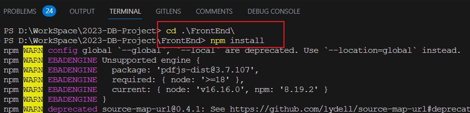
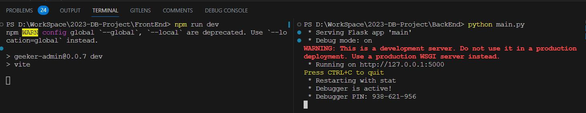

# 

# 数据库课程项目作业-智慧安防小区系统  Intelligent-Security-Community

前端Vue3,后端flask+mysql

node version : v16.16.0

## 一、项目背景

随着城市化进程的加速，小区安全问题日益受到关注。传统的小区安防措施已无法满足现代社会的需求。为了提高小区安全防范水平，保障居民的生命财产安全，我们推出了智慧安防小区系统项目。

## 二、项目目标

本项目旨在建设一个集智能化、自动化、高效化、数据可视化于一体的智慧安防小区系统，实现以下目标：
提高小区安全防范能力，降低安全风险；
提升居民的安全感和满意度；
实现安防资源的整合与优化，提高管理效率。

## 三、使用说明

1、基础配置

- 前端（要安装一会会）:

  终端依次输入:

  ```powershell
  cd .\FrontEnd\
  npm install
  npm run dev
  ```

  

- 后端: 

  ```powershell
  cd .\BackEnd
  python main.py
  ```

  

- 数据库:

  依次将下面的sql文件执行来初始化数据库表:

  ```
  initTable.sql
  setTrigger.sql
  insertData.sql
  ```


## 四、实现内容

- 前后端分离+数据库
- 数据库加入触发器来保证数据一致性
- 人脸识别（基于前端数据）
- flask 蓝图多文件
- 数据表间建立外键等约束
- 登录，个人信息等走自己的后端而非mock端

## 五、功能代码

#### 【1】数据库同步

##### 1.创建后端蓝图

用途：将原来的单个后端代码文件拆分成多个蓝图文件

过程：

1、首先，创建一个**文件夹 routes**（也可以取别的名字）来存放你的蓝图文件。这个文件夹的层级结构应该像下面这样：

```
app.py
routes/
    __init__.py
    auth.py
    info.py
```

2、然后，在**__ init__.py**文件中引入所有的蓝图并在app中注册它们：

```python
# routes/__init__.py

from flask import Flask
from .auth import auth_blueprint # . 表示同级目录
from .info import info_blueprint

def register_blueprints(app: Flask):
    app.register_blueprint(auth_blueprint, url_prefix='') #真正路由=url_prefix+内部写的路由路径
    app.register_blueprint(info_blueprint)
    # 将你创建的蓝图注册到 Flask 应用中。只有注册后，蓝图中定义的路由和视图函数才能被 Flask 应用识别和使用。url_prefix 参数是一个可选的参数，它可以为蓝图中的所有路由提供一个统一的 URL 前缀。
```

3、在**每个蓝图的文件**中，将对应的函数和路由添加到蓝图对象中。例如，在auth.py中：

```python
# routes/auth.py

from flask import Blueprint, json

auth_blueprint = Blueprint('auth', __name__)  # 创建一个名为 'auth' 的蓝图!!!

@auth_blueprint.route('/login', methods=['POST'])
def login():
    info = {"code": 200, "data": {"access_token": "bqddxxwqmfncffacvbpkuxvwvqrhln"}, "msg": "成功"}
    return json.dumps(info)

@auth_blueprint.route('/logout', methods=['POST'])
def logout():
    info = {"code": 200, "msg": "成功"}
    return json.dumps(info)

```

4、然后，再根据这种方式创建剩下的蓝图文件。你的**主文件app.py**应该像这样：

```python
from flask import Flask
from flask_cors import CORS
from werkzeug.utils import secure_filename
from routes import register_blueprints #使用蓝图blueprint改变的地方

app = Flask(__name__)
CORS(app, resources={r'/*': {'origins': '*'}}, supports_credentials=True)

register_blueprints(app) #使用蓝图blueprint改变的地方

if __name__ == '__main__':
    app.run(debug=True)
```


Tips: g , current_app都是flask里全局的内容，可以通过from flask import g,current_app导入


##### 2.数据触发器-保证数据同步

目的：同步对标的操作

```mysql
-- Trigger for personal_info
    -- notes : 插入personal_info表内容后 同步插入 users_outline
DELIMITER //
CREATE TRIGGER personal_info_after_insert
AFTER INSERT ON personal_info
FOR EACH ROW
BEGIN
    INSERT INTO users_outline(id, username, gender, idCard, email, address, createTime, status, avatar_path)
    VALUES (NEW.id, NEW.username, NEW.gender, NEW.idCard, NEW.email, NEW.address, NEW.createTime, 1, NEW.avatar_path);
END //
DELIMITER ;

    -- notes : 更新personal_info表内容后 同步更新 users_outline
DELIMITER //
CREATE TRIGGER personal_info_after_update
AFTER UPDATE ON personal_info
FOR EACH ROW
BEGIN
    UPDATE users_outline
    SET username = NEW.username, gender = NEW.gender, idCard = NEW.idCard, email = NEW.email, address = NEW.address, createTime = NEW.createTime, avatar_path = NEW.avatar_path
    WHERE id = OLD.id;
END //
DELIMITER ;

    -- notes : 删除personal_info表内容后 同步删除 users_outline
DELIMITER //
CREATE TRIGGER personal_info_after_delete
AFTER DELETE ON personal_info
FOR EACH ROW
BEGIN
    DELETE FROM users_outline
    WHERE id = OLD.id;
END //
DELIMITER ;

-- DELIMITER ;
```

*效果*

一张表数据更改，另一张表数据同步修改


#### 【2】页面功能代码

##### 1.登录页面的代码截图：

前端


后端


##### 2.小区大屏可视化代码截图：


##### 3.个人信息管理代码截图

前端


后端


##### 4.发布安防公告代码


##### 5.搜索功能代码


##### 6.通知信息功能


##### 7.管理员增删改查功能代码


## 六、项目价值

本项目的实施将带来以下价值：
提高小区安全防范水平，保障居民生命财产安全；
提升居民的安全感和满意度，增强社区凝聚力；
提高安防资源的管理效率，降低管理成本；
为政府和物业管理部门提供有力的决策支持。
